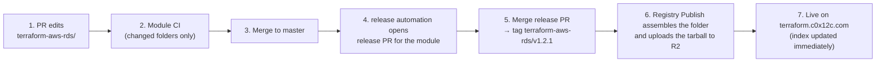

> **ARCHIVED — retired.** The Terraform module scaffold now lives in the [c0x12c/terraform-modules](https://github.com/c0x12c/terraform-modules) monorepo at [`_template/`](https://github.com/c0x12c/terraform-modules/tree/master/_template). See its CONTRIBUTING.md → "Adding a module".

# Terraform Modules Registry

Monorepo for all c0x12c Terraform modules. Each `terraform-<provider>-<name>/`
folder is an independently versioned module published to the **self-hosted
registry** at `terraform.c0x12c.com` under the `c0x12c` namespace.

Consumers reference a module by host-qualified source:

```hcl
module "rds" {
  source  = "terraform.c0x12c.com/c0x12c/rds/aws"
  version = "~> 0.6"
}
```

> **Migrating from the public registry.** The old public source
> `c0x12c/rds/aws` (implicit `registry.terraform.io`) still resolves the
> versions published before the cutover, but **new versions ship only to
> `terraform.c0x12c.com`**. Flip the host prefix to receive new releases; the
> version constraint is unchanged. Both serve in parallel during the
> transition, so cut over on your own schedule.

Design background: [docs/decisions/2026-06-06-monorepo-migration.md](docs/decisions/2026-06-06-monorepo-migration.md)
· [release flow diagram](docs/decisions/2026-06-06-monorepo-release-flow.md)
· [self-hosted registry](docs/decisions/2026-06-08-self-host-registry.md)

---

## How a change becomes a published version



Steps 1, 3, 5 are the only human actions. Merging the release PR is the
"ship it" decision; everything after is automated and idempotent.

### Worked example — patch a module

1. Branch and edit, using a [conventional commit](https://www.conventionalcommits.org/):

   ```bash
   git checkout -b yourname/rds-backup-window
   # edit terraform-aws-rds/variables.tf
   git commit -m "fix: widen allowed backup_window range"
   ```

2. Open the PR. **Module CI** runs `fmt` / `validate` / `tflint` / docs check
   for `terraform-aws-rds` only — a PR never triggers CI for untouched modules.

3. Merge. **release automation** opens (or updates) a release PR titled
   `chore(master): release terraform-aws-rds 0.6.7` containing the version
   bump and the module's `CHANGELOG.md` entry.

4. Merge the release PR when you want the version shipped. The pipeline then
   tags `terraform-aws-rds/v0.6.7`, assembles the folder (sibling sources
   rewritten + `terraform validate`), and uploads the tarball to R2. Verify at
   `https://terraform.c0x12c.com/v1/modules/c0x12c/rds/aws/versions`.

### Commit message → version bump

| Commit prefix | Bump (≥ 1.0) | Bump (0.x) |
|---|---|---|
| `fix:` | patch | patch |
| `feat:` | minor | minor |
| `feat!:` / `BREAKING CHANGE:` footer | major | **minor** |
| `chore:`, `docs:`, `ci:`, `refactor:` | no release | no release |

A commit touching a module's files counts toward that module's next version.
Unmerged release PRs accumulate further commits — one version per merge of the
release PR, not per commit.

## Cross-module changes

Edit any number of modules in one PR — review and CI are atomic. On merge,
release automation opens **one release PR per touched module**
(independent versions); ship them all or hold some back.

For sibling dependencies (one module consuming another), in-repo sources use
relative paths so cross-module changes are testable in a single PR:

```hcl
# inside terraform-datadog-gcp-integration/main.tf
module "service_account" {
  source = "../terraform-gcp-service-account"
}
```

At release time the publish job rewrites this to the registry form with an
**exact pin** of the sibling's currently released version:

```hcl
module "service_account" {
  source  = "c0x12c/service-account/gcp"
  version = "1.0.0"
}
```

Published artifacts are immutable: releasing the sibling later does **not**
retroactively change consumers' pins — each consumer re-pins at its own next
release. For a breaking sibling change, update the sibling and its consumers
in the same PR, then release the sibling first and the consumers after.

## Module CI expectations

Every PR must pass, per changed module:

- `terraform fmt -check -recursive`
- `terraform init -backend=false && terraform validate`
- `tflint` (fails on errors; warnings are reported but non-blocking)
- `terraform-docs` output check, when the module has a `.terraform-docs.yml`

Run locally before pushing:

```bash
cd terraform-aws-rds
terraform fmt -recursive && terraform init -backend=false && terraform validate
tflint
```

**Pin provider upper bounds when a provider release breaks the schema** — a
floating `>= x` constraint can make `validate` fail without any change on our
side (e.g. datadog provider 3.80 made `metric_namespace_configs.filters`
required; fixed with `>= 3.46, < 3.80`).

## Troubleshooting a release

| Symptom | Action |
|---|---|
| Release PR not opened after merge | Commits were `chore:`/`docs:` (no release), or the change didn't touch module files. Check the Module Release workflow run. |
| Registry publish failure issue opened | The R2 publish failed (assemble / validate / upload). Read the linked run log, fix the cause, then re-run **Registry Publish** via *Actions → Registry Publish → Run workflow* with the module + version. Re-upload is idempotent (same tarball + index merge). |
| New version not on `terraform.c0x12c.com` | Confirm the Registry Publish run was green and that `vars.R2_BUCKET` / the `R2_*` secrets are set. Check `https://terraform.c0x12c.com/v1/modules/c0x12c/<name>/<provider>/versions`. |
| Need a dry-run without a release | *Actions → Registry Publish → Run workflow* with `ref: master`, or locally: `python3 scripts/mirror_release.py --module <m> --version <v> --dry-run`. Assembles + validates from the monorepo and uploads nothing. |

## Adding a new module

1. Create `terraform-<provider>-<name>/` with standard layout (`main.tf`,
   `variables.tf`, `outputs.tf`, `versions.tf`, `examples/`).
2. Add the module to `module-release-config.json` (`packages`) and seed
   `.module-versions.json` with `"0.0.0"`.
3. Open the PR — Module CI picks the folder up automatically.

No mirror repo or registry registration is needed: once the first release PR
merges, Registry Publish assembles the folder and uploads it to R2, and it is
live at `terraform.c0x12c.com/c0x12c/<name>/<provider>` immediately.

## Removing a module

Delete the folder and its `module-release-config.json` /
`.module-versions.json` entries in one PR. Versions already in R2 stay
available to consumers until the bucket entry is pruned.

## Repository layout

```
terraform-<provider>-<name>/   one folder per module (the only place you edit)
docs/decisions/                architecture decision records
scripts/                       release tooling (mirror_release.py, cascade_release.py)
tools/registry/                self-hosted registry (Cloudflare Worker + R2)
.github/workflows/
  module-ci.yml                PR checks, changed modules only
  module-release.yml           release automation versioning + publish fan-out
  registry-publish.yml         per-module R2 publish (reusable + manual)
  registry-register.yml        legacy public-registry registration (unused for R2)
```

> **Cutover status:** the monorepo is the source of truth for module code.
> New releases publish **only** to the self-hosted registry at
> **`terraform.c0x12c.com`** (Cloudflare Worker + R2, live — see
> `tools/registry/`). The old public mirror repos are frozen — kept public and
> read-only so versions published before the cutover keep resolving via
> `registry.terraform.io` — and are retired as consumers move to
> `terraform.c0x12c.com`. New versions do not appear on the public registry.
