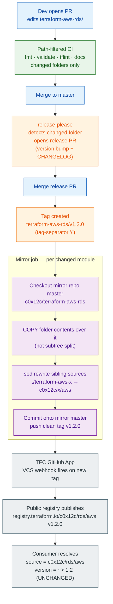

# New Release Flow — Option C (Hybrid Monorepo)

How a module version ships under the chosen design: the monorepo is the source of
truth, and `module-release.yml` release CI invokes `registry-publish.yml` to mirror each changed folder back to its per-module repo so the
public registry and every existing consumer reference keep working unchanged.

## End-to-end pipeline

## What changed vs. today

| | Today (116 submodules) | New (Option C) |
|---|---|---|
| Where you edit | Per-repo, one at a time | One monorepo PR (cross-module atomic) |
| Versioning | Per-repo CHANGELOG.md → release.yml → tag | `module-release.yml` with release-please per-folder → `<module>/vX.Y.Z` tag |
| Registry publish | TFC VCS webhook on each repo's tag | Same webhook, on the **mirror** repo's clean tag after `registry-publish.yml`; `registry-register.yml` remains one-time setup |
| Consumer source ref | `c0x12c/<name>/<provider>` | **Identical — no change** |
| Config sync | sync-configs.sh + state.yaml + per-repo Dependabot/secrets | Single monorepo config; mirrors are dumb outputs |

## Confidence rate

Overall: **~78% — Medium-High.** The orchestration is well-understood; the two
load-bearing risks are the sibling-source rewrite (heterogeneous `source` formats)
and confirming TFC's tag-triggered publish on the mirror repos before cutover.

| # | Step | Confidence | Basis / risk |
|---|---|---|---|
| 1 | Path-filtered PR CI | **95% High** | Standard GitHub Actions `paths`/dorny-filter matrix. Well-trodden. |
| 2 | release-please monorepo mode + per-folder changelog | **90% High** | Mature tool with first-class manifest/monorepo support. |
| 3 | `tag-separator: "/"` → `<module>/vX.Y.Z` | **88% High** | Documented config; verify it round-trips with seeded last-release versions. |
| 4 | Clean-tag map `<module>/vX.Y.Z` → `vX.Y.Z` | **90% High** | Pure string transform in CI; trivial to test. |
| 5 | Copy folder + commit onto mirror master | **85% Med-High** | Replaces subtree-split correctly; mirror history preserved (no force-push). |
| 6 | sed rewrite sibling `../x` → `c0x12c/x/aws` | **70% Medium** | **Highest risk.** `source` formats vary; needs a tested codemod + per-module validate, not blind sed. |
| 7 | TFC auto-publish on mirror tag | **80% Med-High** | Matches how TFC VCS modules publish. **Verify before cutover** that publish is webhook/tag-driven, not script-driven, on a real mirror. |
| 8 | Mirror freeze keeps VCS connection intact | **80% Med-High** | Stripping Dependabot/PRs/branch-protections must NOT remove the TFC GitHub App install — silent publish breakage if it does. |
| 9 | Idempotent + retryable mirror job across 100 repos | **75% Medium** | Our history (orphaned refs, batch push failures) is exactly this failure mode; needs alarms + partial-failure recovery. |
| 10 | Consumer back-compat (zero migration) | **95% High** | Registry refs + `~>` ranges resolve unchanged; this is the whole point of C. |

### Before committing to implementation, de-risk:
1. **Prove step 7 end-to-end on one real mirror** — push a clean tag, confirm the public registry publishes the new version. This validates the core assumption of C.
2. **Build step 6 as a tested codemod** over the 33 sibling refs, then `terraform validate` each module — don't ship raw sed.
3. **Dry-run step 9** on a 3-module subset before the full 116 cutover.

## Sibling release ordering (runbook — added 2026-06-07)

In-repo sibling refs are relative (`../terraform-<provider>-<name>`); the mirror
job rewrites them to registry refs with an **exact pin** taken from
`.module-versions.json` at the *parent's* release time. Two operational
consequences:

1. **Merge release PRs leaf-first.** When one change touches a leaf and its
   parent(s), merge the leaf's release PR before the parent's. Merging the
   parent first pins the leaf's *previous* version into the parent's mirror —
   a torn release.
2. **A leaf fix does not reach registry consumers until every consuming parent
   re-releases.** Parents pin exact sibling versions at release; there is no
   `~>` range float anymore. After releasing a leaf fix (especially security
   fixes), find consuming parents via
   `grep -rl '"\.\./terraform-<provider>-<name>"' --include='*.tf' .`
   and land a `fix(deps): bump <leaf>` commit per parent so release-please
   re-releases them. (Automation for this cascade is a planned follow-up.)

CI note: `module-ci.yml`'s detect job expands the changed-module set with the
reverse-dependency closure, so a leaf interface break fails consuming parents'
checks in the same PR.
