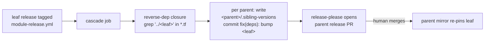

# Automated parent re-release cascade on leaf module releases

Status: **Accepted** · Date: 2026-06-07 · Scope: `terraform-modules`

## Decisions taken (2026-06-08)

- **D1 — which releases cascade: all releases** (as-built). The cascade fires on
  every leaf release. A `fix:`-only filter is deferred as a volume optimization
  if changelog noise proves excessive — not needed for correctness.
- **D2 — who merges cascade release PRs: humans.** The cascade only *creates*
  `fix(deps)` commits + opens parent release PRs; a human merges each, so a
  registry publish never happens unreviewed. No auto-merge wiring.
- **Enablement is two repo variables, gated for safety:**
  - `CASCADE_ENABLED=true` — arms the job in **dry-run** (prints planned bumps,
    zero mutation). **Set 2026-06-08.**
  - `CASCADE_EXECUTE=true` — promotes dry-run to real commits/pushes. Flip only
    after observing one clean dry-run on a real release. **Not yet set.**
  Revert either instantly by unsetting the variable.

## Problem

In-repo sibling refs are relative (`../terraform-<provider>-<name>`); the mirror
job rewrites them to registry refs with an **exact pin** from
`.module-versions.json` at the *parent's* release time. Consequence: a leaf
module fix reaches registry consumers **only when every consuming parent
re-releases**. There is no `~>` range float anymore.

Today this is a manual runbook step (see
`2026-06-06-monorepo-release-flow.md`, "Sibling release ordering"): after a
leaf releases, a human greps for consuming parents and lands a bump commit per
parent. Easy to forget; security fixes silently strand.

## Design

1. **Trigger**: a `cascade` job appended to `module-release.yml`, running after
   the `mirror` job when `releases_created == 'true'`.
2. **Reverse-dep closure**: same grep used by `module-ci.yml` detect
   (`source = "../<module>"`), one level per release event — transitive
   propagation happens naturally as each parent's release triggers its own
   cascade.
3. **Attribution artifact**: a generated `<parent>/.sibling-versions` JSON file
   (sibling → version consumed). The cascade commit touches only this file with
   message `fix(deps): bump <leaf> to vX.Y.Z in <parent>`.
   Side benefit: each release carries an auditable record of the sibling
   versions it consumed.
4. **Token**: GitHub App token (same mint as the release job) so the cascade
   commit triggers `module-release.yml` again for the parent's release PR.
5. **Guards**:
   - Skip a parent whose pending release PR already contains a bump for this
     leaf at this version (idempotent re-runs).
   - Skip if the parent's `.sibling-versions` already records the new version.
   - Cycle guard: refuse to cascade into a module already present in the
     triggering chain (sibling graph should be a DAG; enforce it).

## Evidence (verified 2026-06-07 on a scratch branch)

- **Attribution works**: a commit touching only
  `terraform-aws-ses-monitoring/.sibling-versions` with a `fix(deps):` message,
  dry-run through release-please (config `module-release-config.json`,
  manifest `.module-versions.json`), produced exactly one candidate release PR:
  `ses-monitoring 1.0.0 → 1.0.1`, changelog section "Bug Fixes" with the bump
  line, manifest update included. No other module affected.
- **App token survives the repo rename**: `module-release.yml` dispatched
  post-rename, token minted, run green. (Cosmetic: `app-id` input is deprecated
  in `create-github-app-token@v3`; migrate to `client-id` when touching the
  workflow.)

## Decisions required

### D1 — Which leaf releases cascade?

| Option | Effect | Risk |
|---|---|---|
| **`fix:` releases only (recommended)** | Cascade targets the actual gap: fix propagation. Bounded release volume. | A parent keeps consuming a leaf `feat:` at next natural release rather than immediately — acceptable; features aren't stranded fixes. |
| All releases (`feat:` + `fix:`) | Parents always pin latest. | A single leaf `feat:` fans out to N parent releases; busy weeks multiply fleet release volume and changelog noise. |

### D2 — Who merges cascade release PRs?

| Option | Effect | Risk |
|---|---|---|
| **Human merges (recommended)** | One click per cascade PR; release governance preserved. | A forgotten PR strands the fix — same failure as today, but now visible as an open PR instead of invisible. |
| Auto-merge on green CI | Fully closed loop. | Unreviewed releases reach a public registry; a bad leaf release auto-propagates fleet-wide before anyone looks. |

## Out of scope

- Multi-level batching (releasing a leaf and grandparent in one event) — the
  natural per-level cascade covers it with one extra release cycle per level.
- Terraform provider-constraint reconciliation across parents (surfaced
  separately when parents validate against leaf HEAD in CI).

## Rollout

1. Implement behind a `cascade_enabled` workflow input defaulting off; dry-run
   mode prints planned bumps without committing.
2. Enable for one leaf→parent pair (e.g. `terraform-datadog-dashboard` →
   `terraform-aws-ses-monitoring`), verify one full cycle on the registry.
3. Enable fleet-wide.
