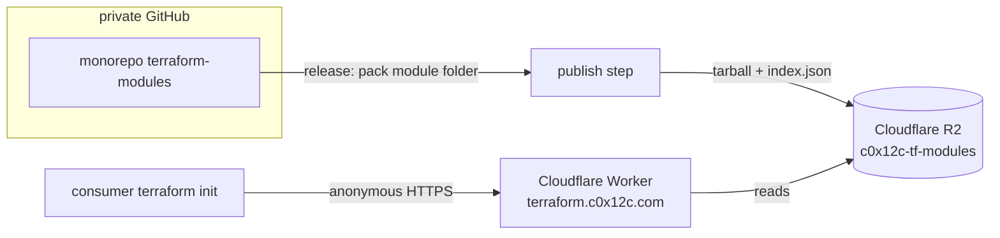

# Self-hosted public module registry on Cloudflare R2

Status: **Accepted** · Date: 2026-06-08 · Scope: `terraform-modules`

## Goal

Retire the 115 per-module mirror repos while keeping module consumption
**public and anonymous**, and keep publishing **new versions for every module**.

## Why the mirrors exist (and why they can't shrink on registry.terraform.io)

The public Terraform Registry is **one-public-repo-per-module by design**
(identity inferred from repo name, versions from root tags; no config surface).
So every `c0x12c/<name>/<provider>` module needs a backing repo — that's the
mirror fleet. The registry can't publish from a monorepo subdirectory, and
archiving a mirror makes it read-only (breaks the release push). The only way
to both keep public+anonymous consumption AND drop the per-module repos is to
serve the modules ourselves: the module registry protocol (`modules.v1`) is an
open spec with no auth requirement, so a tiny self-hosted implementation is
spec-compliant and anonymous.

## Target architecture



- **Worker** (`tools/registry/worker.js`) serves the three `modules.v1`
  endpoints + a tarball route. Stateless, ~60 lines.
- **R2** holds `index.json` (module → versions) and
  `modules/<ns>/<name>/<provider>/<version>.tar.gz` (module files at archive root).
- Source monorepo stays **private**; only built tarballs are public.
- Consumer source: `terraform.c0x12c.com/c0x12c/<name>/<provider>` — namespace and
  path kept identical to today, so the consumer change is a pure host prefix.

## What makes the migration swift: backfill-first, dual-run

The slow/risky part of any registry move is the consumer `source` rewrite. We
make it a **zero-window, per-consumer flip** by making the new registry a
**complete superset before anyone cuts over**:

1. **Backfill every historical version first** (`backfill.py`): each mirror repo
   already holds the full tag history. For every semver tag, `git archive` →
   tarball (files at root) → R2, accumulating `index.json`. After this run,
   `terraform.c0x12c.com` serves **every existing version of every module,
   byte-identical** — while the public registry is still fully live.
2. **Dual-publish new releases**: add an R2 publish step to `module-release.yml`
   beside the existing mirror push. New versions land in both. Nothing breaks.
3. Because the new registry is never incomplete, **each consumer flips the host
   whenever they want, independently, with no version gap and instant rollback**
   (the old registry keeps serving until retired). No coordinated big-bang.

## Migration phases

| Phase | Action | Consumer impact | Reversible |
|---|---|---|---|
| 0 — Stand up (½ day) | Create R2 bucket; deploy Worker to `terraform.c0x12c.com` (TLS auto). Validate one module end-to-end. | none | n/a |
| 1 — Backfill (1 automated run) | `backfill.py` uploads all tags of all mirrors → R2 + `index.json`. | none | delete bucket |
| 2 — Dual-publish | Add R2 publish step to release pipeline (behind a flag), beside mirror push. | none | unset flag |
| 3 — Cutover (swift) | Find/replace consumer sources `registry.terraform.io/c0x12c/x/aws` → `terraform.c0x12c.com/c0x12c/x/aws`. Flip internal configs immediately; external on their own schedule. | one host prefix change | re-flip host |
| 4 — Retire mirrors | Remove mirror push from pipeline; archive/delete the 115 repos; decommission the TFC GitHub App. | none (already moved) | un-retire from git history |

Phases 0–2 are zero-impact and can land in days. Phase 3 is the only consumer
touch and is a mechanical prefix change, doable incrementally with no deadline
pressure because both registries run in parallel.

## Consumer change

```hcl
# before
source = "c0x12c/rds/aws"                       # implicit registry.terraform.io
# after
source = "terraform.c0x12c.com/c0x12c/rds/aws"   # version constraint unchanged
```
`version = "~> 0.6"` ranges keep working — Terraform resolves them client-side
from the `/versions` list the Worker returns.

## Risks & mitigations

- **New critical dependency** (init fails if the registry is down): Cloudflare
  edge + R2 are highly available and the Worker is stateless; **keep the mirrors
  as hot fallback through Phase 3** — don't retire until traffic has moved.
- **Tarball format**: `git archive`/`publish_registry.py` pack files at archive
  root, so `X-Terraform-Get` needs no `//subdir`. Validated in Phase 0.
- **No module signing** in the protocol (unlike providers) — nothing to manage.
- **index.json caching**: immutable tarballs cache freely; purge/short-TTL
  `index.json` on publish so new versions appear immediately.
- **Discoverability loss**: self-hosted modules don't appear on
  registry.terraform.io search. If public discoverability matters, keep the
  public listings alive in parallel (they cost nothing once frozen).

## Cost

Worker free tier (100k req/day) + R2 free tier (10 GB, **zero egress**). 115
modules × all versions of small `.tar.gz` ≪ 10 GB. Effectively **$0/mo +
domain**.

## Implementation

`tools/registry/` — `worker.js`, `publish_registry.py`, `backfill.py`,
`wrangler.toml`, `README.md`. The release pipeline dual-publishes to R2 in the
same pass as the mirror push: `scripts/mirror_release.py` packs the
already-rewritten, validated module tree (no relative `../` sources) and uploads
it when invoked with `--r2-bucket`. The `registry-publish.yml` workflow adds that
flag and the R2 secrets **only when the repo variable `R2_PUBLISH_ENABLED` is
`'true'`** — so the default path is byte-for-byte the existing mirror behavior
with zero added dependency. Flip the variable to begin dual-publishing.

> **Bare sibling refs (Phase-4 prerequisite).** R2 tarballs currently carry the
> same sibling rewrite as the mirror: `source = "c0x12c/<name>/<provider>"`
> (implicit `registry.terraform.io`). This resolves correctly while the public
> mirrors are live (dual-run). **Before retiring the mirrors (Phase 4)**, the
> rewrite must be host-qualified to `terraform.c0x12c.com/c0x12c/<name>/<provider>`
> or multi-module packages will fail to resolve their siblings. Tracked as a
> Phase-4 follow-up; do not retire mirrors until it lands.

## Operational rollout (runbook)

All steps below are **operational** — they require the Cloudflare account and
GitHub admin access, and are performed by hand (not by the implementation PR).
The PR is inert until step 6.

1. **Create the R2 bucket** `c0x12c-tf-modules` in the Cloudflare account. Mint an
   R2 API token (S3-compatible) with object read/write on that bucket; note the
   account `R2_ENDPOINT` (`https://<account>.r2.cloudflarestorage.com`).
2. **Deploy the Worker.** From `tools/registry/`: `wrangler deploy` (bucket binding
   `BUCKET` → `c0x12c-tf-modules`, per `wrangler.toml`). Add the custom domain
   `terraform.c0x12c.com` to the Worker — Cloudflare provisions TLS automatically.
3. **Validate end-to-end with a REAL `terraform init`** (gating milestone — do not
   proceed past this until green). Manually pack one module to R2 (or run a scoped
   `backfill.py`), then in a scratch dir:
   `source = "terraform.c0x12c.com/c0x12c/<name>/<provider>"`, `terraform init`.
   Confirm the discovery, `/versions`, `X-Terraform-Get`, and tarball-at-root all
   work against a live Terraform client. If any fails, stop and fix before backfill.
4. **Backfill all history.** With `R2_ENDPOINT` + `AWS_ACCESS_KEY_ID` +
   `AWS_SECRET_ACCESS_KEY` exported, run `python3 tools/registry/backfill.py
   --org c0x12c --bucket c0x12c-tf-modules` (reads every mirror's tag history →
   R2 + `index.json`). After this, the registry is a complete superset of the
   public one. Re-runnable; idempotent.
5. **Wire GitHub secrets** on the repo: `R2_ENDPOINT`, `R2_ACCESS_KEY_ID`,
   `R2_SECRET_ACCESS_KEY`; and repo **variable** `R2_BUCKET=c0x12c-tf-modules`.
6. **Enable dual-publish.** Set repo variable `R2_PUBLISH_ENABLED=true`. From the
   next release on, every new version lands in both the mirror and R2. Verify one
   release appears in `index.json` and resolves via `terraform init`.
7. **Cutover (swift, per-consumer).** Find/replace consumer sources
   `registry.terraform.io/c0x12c/x/aws` → `terraform.c0x12c.com/c0x12c/x/aws`.
   Both registries serve in parallel, so flip internal configs immediately and let
   external consumers move on their own schedule. Rollback = re-flip the host.
8. **Retire mirrors (only after the bare-ref note above is resolved).** Land the
   host-qualified sibling rewrite, confirm no consumer still points at
   `registry.terraform.io`, then remove the mirror push, archive/delete the mirror
   repos, and decommission the TFC GitHub App.

To roll the whole thing back before step 8: unset `R2_PUBLISH_ENABLED` (publishing
reverts to mirror-only) and/or delete the bucket. Nothing else depends on it.
